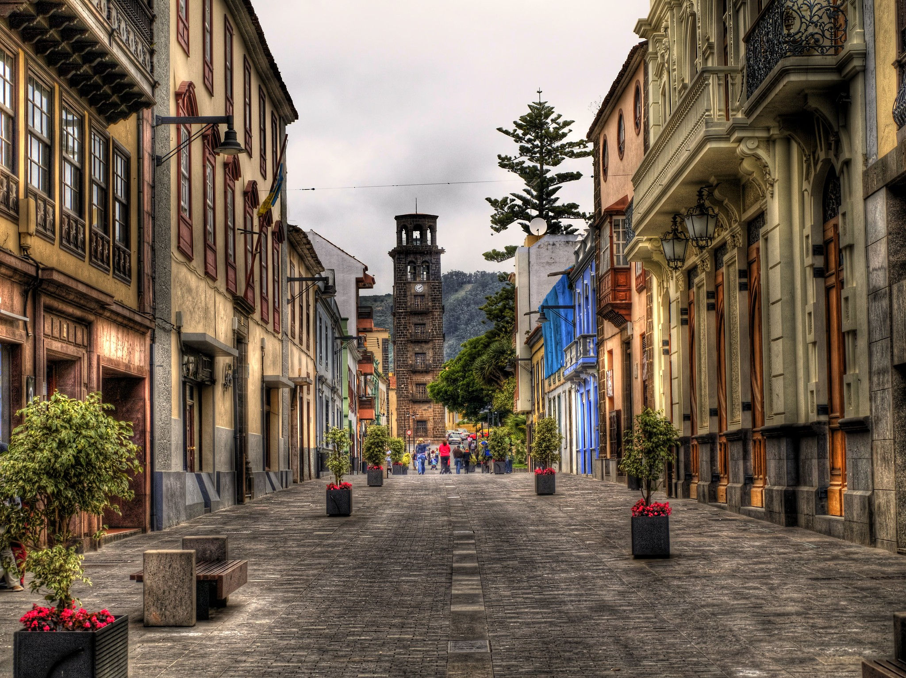

Title: Tenerife
Date: 2023-04-01 10:00
Lang: en
Slug: ciudad
url: en/ciudad/
save_as: ciudad/index.html

# The City

## Tenerife

A tourist destination par excellence, Tenerife is a safe and quiet place with
a pleasant climate throughout the year.

The island of [Tenerife](https://www.holaislascanarias.com/tenerife/) offers
a wide variety of accommodation and leisure options. It also allows you to
enjoy nature and local culture, as well as the different nearby beaches,
promoting interaction among those attending the event.

  

    

      
      
Nature

    

  

  

    

      
      
Beaches

    

  

  

    

      
      
Technology

    

  

## "La Laguna" University

["La Laguna" University](https://www.ull.es/) (ULL) offers a strategic location
since it is located in San Cristóbal de La Laguna near the Tenerife North
Airport, and the capital city of Santa Cruz de Tenerife, with an adequate
public transport service for the transfer of attendees .

The [Guajara Campus](https://www.ull.es/la-universidad/campus/#campus_guajara),
the place where the conference will be held, is the largest in extension of the
entire ULL, and has a [tram station](https://goo.gl/maps/tZ9eQTcGebhxqZ9P8) 20
meters away. From there we will be literally two steps away from the [Aulario
General de
Guajara](https://www.ull.es/portal/puertas-abiertas/aulario-general-de-guajara/),
the scenario of the PyConES23.

  

    

      
      
ULL

    

  

## "La Laguna"

[San Cristóbal de La Laguna](https://turismo.aytolalaguna.es/), better known as
La Laguna, is the second most populous city in Tenerife and the third in the
Canary Islands. It is located in the northeast of the island of Tenerife, next
to the capital Santa Cruz de Tenerife, and is part of the metropolitan area.

The city was declared a World Heritage Site by Unesco in 1999 for being
a unique example of an unwalled colonial city. Its name comes from the fact
that it was built on an old lagoon that existed in the area.

Historically, the Canary Islands have been a strategic point -cultural, social
and economic- between Europe and Latin America.

  

    

      
      
La Laguna

    

  

* Nature photo by
  [Joshua Humpfer](https://unsplash.com/@jhvisuals_de?utm_source=unsplash&utm_medium=referral&utm_content=creditCopyText)
* Beaches photo by
  [Maxim Berg](https://unsplash.com/@maxberg?utm_source=unsplash&utm_medium=referral&utm_content=creditCopyText)
* Technology photo by
  [European Space Agency](https://flickr.com/photos/europeanspaceagency/33199668323/)
* ULL photo by
  [Estudia en España](https://www.estudia-en-espana.com/mejores-universidades-de-espana/universidad-de-la-laguna/)
* La Laguna photo by
  [Javier Losa](https://www.flickr.com/photos/javier_losa/6700465521/)
